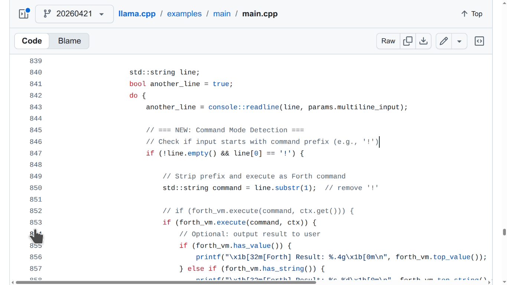
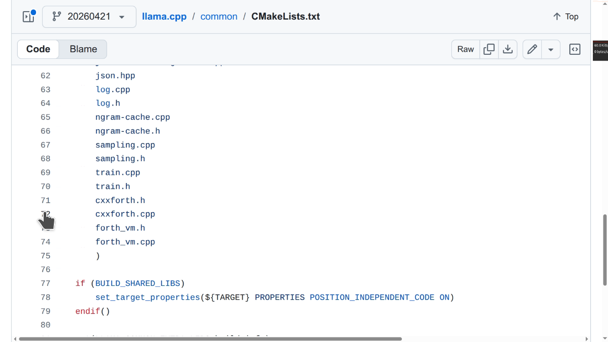
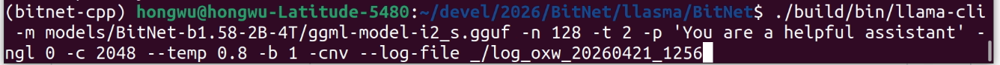
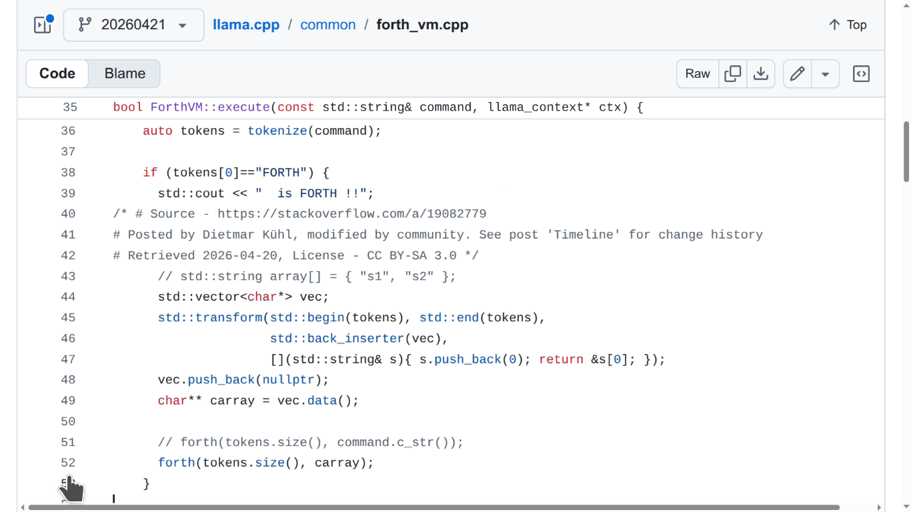

<!-- markdownlint-disable-file -->
# LLASMA: LargeLanguage + StackMachine Architecture

- A. Introduction
- B. How We Code It
- C. Install-Run-Test-Contribute
- D. Theories & Visions

## A. Introduction

**LLM inference in pure C/C++ with embedded cxxforth stack machine + Microsoft BitNet support**

LLASMA is a purpose-built fork of [llama.cpp](https://github.com/ggerganov/llama.cpp) (on the `20260421` branch) that integrates a **trusted Forth-based stack machine** (via [cxxforth](https://github.com/kristopherjohnson/cxxforth)) directly into the inference loop.

The goal is to create **LLASMA agents**: systems that maintain a clear separation between:  
- **untrusted probabilistic knowledge** (from the LLM), and  
- **trusted executable skills** (implemented as reliable Forth words / Phoscript primitives in the stack machine).

## B. How We Code It

The theories and visions of LLASMA will be too big to fit in one paragraph, as we believe it is the MOST significant breakthrough since ChatGPT itself -- so we move that to the end, and to entertain the impatient CODERS first -- no non-sense.



```
                        Figure 1
```


1. The "entry point" to FORTH/Phoscript shell is show in figure 1 above, around line 843 where main.cpp waits for user input.

- [https://github.com/llasma/llama.cpp/blob/20260421/examples/main/main.cpp](https://github.com/llasma/llama.cpp/blob/20260421/examples/main/main.cpp)




```
                        Figure 2
```

2. As shown in figure 2, the `add_library` directive in `CMakeLists.txt` at line 53 includes FORTH related files from line 71 to 74:

- [https://github.com/llasma/llama.cpp/blob/20260421/common/CMakeLists.txt](https://github.com/llasma/llama.cpp/blob/20260421/common/CMakeLists.txt)

```
    cxxforth.h
    cxxforth.cpp
    forth_vm.h
    forth_vm.cpp
```


```
                        Figure 3
```



```
                        Figure 4
```




```
                        Figure 5
```


## Philosophy

- Start with a tiny, auditable core of primitive stack operations (`DUP`, `SWAP`, `DROP`, `+`, `@`, `!`, `:`, `;`, etc.).
- Use the LLM to **propose** new skills in Forth syntax.
- Validate and **promote** safe proposals to the trusted dictionary.
- This gives the agent incremental, verifiable skill acquisition while keeping execution deterministic and sandboxable.

This approach aligns with reliable agent design: the stack machine is the "doer", the LLM is the "thinker/knower".

## Key Features

- Full llama.cpp compatibility (LLaMA, LLaMA 2/3, Mistral, Mixtral, BitNet b1.58, and many others)
- Embedded **cxxforth** stack machine as the skill engine
- Microsoft **BitNet** (1.58-bit) model support for extreme efficiency
- All standard backends: CUDA, Metal, Vulkan, SYCL, hipBLAS, BLAS, etc.
- Safe skill acquisition pipeline (LLM proposal → validation → registration)
- Clear tracking of changes via the `CHANGES/` directory
- Minimal dependencies, high performance, runs on everything from laptops to servers

## Quick Start

### 1. Clone with submodule (for cxxforth)

```bash
git clone --recursive https://github.com/llasma/llama.cpp.git
cd llama.cpp
git checkout 20260421


# LLASMA

2026-04-21

(One day after 420!!)